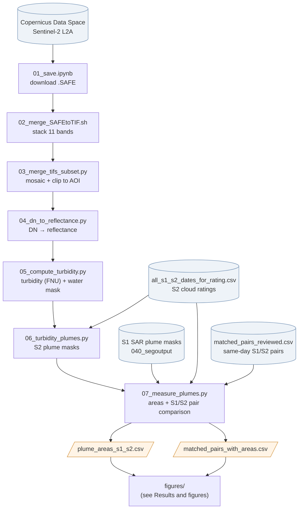
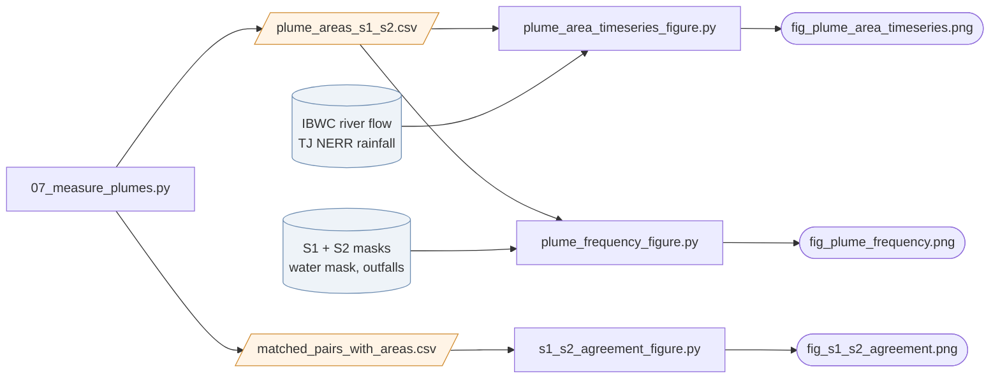
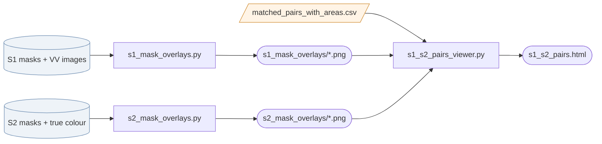

# Sentinel-2 turbidity workflow (San Diego / Tijuana River coast)


Downloads Sentinel-2 L2A scenes, mosaics and clips them to the study area,
converts them to surface reflectance, computes turbidity (FNU, Nechad),
checks them with QC figures, segments turbid plumes near outfalls, measures the
S2 plumes alongside the Sentinel-1 (SAR) plumes, and makes the results figures.

Scripts run in order. Paths are set near the top of each script and assume the
`/home/jovyan/s2/` layout; edit them if your folders differ.

## Workflow



Cylinders are inputs from outside this repo, boxes are scripts, slanted boxes
are the CSVs that the figure scripts read, and rounded boxes are figures. The
diagrams render on GitHub; PNG copies are in `docs/` for viewing offline.

## Steps

| Step | Script | Input → output | What it does |
|---|---|---|---|
| 01 | `01_save.ipynb` | Copernicus Data Space → S3 bucket | Searches the CDSE STAC catalogue for L2A scenes over the AOI and date range, and copies the `.SAFE` products to S3 with rclone. Set the AOI, dates, remotes and `DST_PREFIX` in the first cell (`LIMIT` > 0 for a small test). |
| 02 | `02_merge_SAFEtoTIF.sh` | `.SAFE` folders → `tifs_2022_2025/` | Stacks 11 bands of each granule into one GeoTIFF (UInt16 DN, 20 m bands + 10 m bands). Run from the folder that contains the `.SAFE` products. |
| 03 | `03_merge_tifs_subset.py` | `tifs_2022_2025/` → `mosaics_2022_2025/` | Mosaics granules from the same acquisition time and clips them to a lon/lat polygon. Output: `mosaic_<YYYYMMDDTHHMMSS>_clipped.tif`. |
| 04 | `04_dn_to_reflectance.py` | mosaics → `03_mosaics_2022_2025_reflectance/` | DN → bottom-of-atmosphere reflectance: `(DN − 1000) / 10000`. NoData (DN 0) → NaN. |
| 05 | `05_compute_turbidity.py` | reflectance → `05_TURB/`, `water_mask_<date>.tif` | Computes Nechad turbidity (FNU) over water using one fixed water mask (see below). The earlier version that also wrote `05_NDTI/` and `05_NDCI/` is `_archive/05_compute_ndti_ndci_full.py`. |
| 05b | `05b_qc_figures.py` | reflectance + NDTI (from `_archive/05_compute_ndti_ndci_full.py`) → `06_QC/` | QC figures per date (true colour, spectral profiles at two points, NDTI map and histogram), an all-dates overview and `QC_stats.csv`. |
| 06 | `06_turbidity_plumes.py` | `05_TURB/` → `06_TURB_plumes/` | Main plume step, on S2 dates rated 3 only: skips hazy dates (median B08 over water > 0.10), masks cloud pixels (B08 > 0.05), smooths turbidity (50 m), marks water ≥ 5 FNU above that date's median water turbidity (per Sentinel-2 tile, outside a 150 m surf zone), cleans up with morphology, and keeps patches within 1.5 km of an outfall. Writes `_TURB_mask.tif`, a 6-panel QC figure per date and `06_summary.csv`. The method is listed step by step at the top of the script. |
| 07 | `07_measure_plumes.py` | S2 masks (step 06) + S1 masks + ratings + matched pairs → `07_figures/plume_areas_s1_s2.csv`, `07_figures/matched_pairs_with_areas.csv` | Calculations only, no figures. Measures the plume area (km²) of every S1 mask and every cloud-free (rating 3) S2 mask. For each same-day S1/S2 pair, puts both masks on the S2 grid and records both areas, the distance between plume centres and the mask overlap (IoU). The figure scripts in `figures/` read these two CSVs. |
| 06 (older) | `06_isegprob_ndti*.py`, `06_isegprob_ndti_tuning.ipynb` | NDTI → plume masks | Earlier NDTI-based versions of the same segmentation. |

Step 03 example:

```bash
python 03_merge_tifs_subset.py \
  ../tifs_2022_2025 \
  ../mosaics_2022_2025 \
  --wkt "POLYGON ((-117.35 32.3, -117.02 32.3, -117.02 32.75, -117.35 32.75, -117.35 32.3))"
```

## Results and figures

Every figure has its own script in `figures/`. Each one is standalone: open it
and read it top to bottom (file locations, settings, load, calculate, plot). Run
`07_measure_plumes.py` first; the figure scripts only read its CSVs and the
original masks. Each script saves its PNG (or HTML) next to itself in `figures/`.



### Results figures

| Figure | Script | Reads | What it shows |
|---|---|---|---|
| `fig_plume_area_timeseries.png` | `plume_area_timeseries_figure.py` | `plume_areas_s1_s2.csv`, IBWC daily flow, TJ NERR 15-min met data | Plume area 2022–2025, S1 (top) and cloud-free S2 (bottom): each scene with a plume as a faint dot, a 10-day rolling mean as a line, and wet-weather days as grey bands. No flow or rain statistics are calculated. |
| `fig_s1_s2_agreement.png` | `s1_s2_agreement_figure.py` | `matched_pairs_with_areas.csv` | Same-day S1/S2 pairs with cloud-free S2: (a) S1 vs S2 plume area, (b) distance between plume centres, (c) mask overlap (IoU). |
| `fig_plume_frequency.png` | `plume_frequency_figure.py` | `plume_areas_s1_s2.csv` (which masks), the masks, water mask, outfall shapefile | Maps of the % of scenes in which each water pixel was flagged as plume, S1 and S2 side by side (S1 resampled onto the S2 grid). |

**Plume area time series, how the parts are defined** (settings at the top of
the script):

- *Scenes:* masks with at least one plume pixel (area > 0). S2 is cloud-free
  (rating 3) scenes only.
- *Line:* for each scene, the mean area of all scenes from the same sensor
  within ±5 days (`WINDOW = "10D"`). Fewer than 2 scenes in the window
  (`MIN_SCENES`) leaves a gap, so S2 breaks where cloud-free scenes are sparse.
- *Grey bands, wet weather:* rain ≥ 0.1 in at the TJ NERR station that day or
  in the previous 3 days (the wet-weather definition used in southern California
  beach bacteria TMDLs), **or** daily Tijuana River flow above 100 MGD (about the
  90th percentile of 2022–2025 daily flow). Bands are context only.

### Checking figures

Per-scene images for checking the masks by eye; not used in the results.



| Output | Script | What it shows |
|---|---|---|
| `s1_mask_overlays/*.png` | `s1_mask_overlays.py` | Each S1 plume mask over its VV backscatter image. |
| `s2_mask_overlays/*.png` | `s2_mask_overlays.py` | Each S2 plume mask over its true-colour image. |
| `s1_s2_pairs.html`, `s1_s2_pairs_standalone.html` | `s1_s2_pairs_viewer.py` | Page to step through matched pairs side by side (arrow keys). The standalone file embeds all images, so it can be shared on its own. |
| (notebook figure) | `sentinel_comparison_figure.ipynb` | One row per chosen date, S1 image beside S2 image. Edit `DATES` in the Config cell. |

### Run order

```bash
python 07_measure_plumes.py                    # after step 06; writes the two CSVs
python figures/plume_area_timeseries_figure.py
python figures/s1_s2_agreement_figure.py
python figures/plume_frequency_figure.py
```

The figure from the earlier all-in-one script (`fig_area_flow_by_year.png`, one
panel per year with flow and rain axes) was retired after review; that script is
kept locally as `_archive/07_results_figures.py`.

## Band order in the mosaics

Created in step 02 and assumed by every later step (1-based, as read by rasterio):

| 1 | 2 | 3 | 4 | 5 | 6 | 7 | 8 | 9 | 10 | 11 |
|---|---|---|---|---|---|---|---|---|---|---|
| B01 | B02 | B03 | B04 | B05 | B06 | B07 | B08 | B8A | B11 | B12 |

## Indices

- **NDWI** = (B03 − B08) / (B03 + B08). Used only to build the water mask (water = NDWI ≥ 0.01).
- **NDTI** = (B04 − B03) / (B04 + B03). Turbidity: sediment raises red, so higher = more turbid.
  (archived script only)
- **NDCI** = (B05 − B04) / (B05 + B04). Chlorophyll. (archived script only)
- **Turbidity (FNU)** = A·ρ / (1 − ρ/C), ρ = B04 reflectance, with the Sentinel-2 665 nm
  coefficients of Nechad et al. (2016, ESA Living Planet Symposium, Table 3):
  A = 610.94, C = 0.2324 (B = 0). Pixels with ρ < 0 or ρ ≥ C are left blank.

## Notes

- **Reflectance offset.** ESA added `BOA_ADD_OFFSET = −1000` with processing baseline
  04.00 (25 Jan 2022). The scenes downloaded in step 01 come from the reprocessed
  Collection-1 archive (baseline ≥ 05.00), which carries the offset for *all* dates,
  including earlier ones, so step 04 applies it everywhere. Sanity check: raw blue DN over
  dark water sits at about 1000–1200. Only use `OFFSET = 0` for genuine baseline 03.xx
  products.
- **Fixed water mask.** Step 05 builds the mask once from a clear reference date
  (`WATER_MASK_DATE`, currently `20240825`) and applies it to every date. Computing NDWI
  per date dropped open water on hazy scenes (2022-05-13 lost 41%). If you change the
  date, also update `WATER_MASK_LABEL` in `05b_qc_figures.py`.
- **Clouds, haze and sun glint are not masked.** Pixels under cloud or haze still get NDTI values,
  biased toward 0, and raise turbidity (hazy scenes can exceed the 10 FNU threshold everywhere). Screen or exclude these dates (e.g. median B08 over water > ~0.05)
  before comparing NDTI through time.
- **Very dark winter scenes.** Red reflectance over clear water can be ~0 or slightly
  negative after atmospheric correction, which pushes NDTI below −1. Treat those values as
  noise.
- **Tile seams.** Some dates show a straight jump in NDTI where two granules meet in
  the mosaic.
- **macOS external drives** create `._*.tif` files next to each GeoTIFF. The scripts glob
  `*.tif`, so delete those or filter them out before running.
